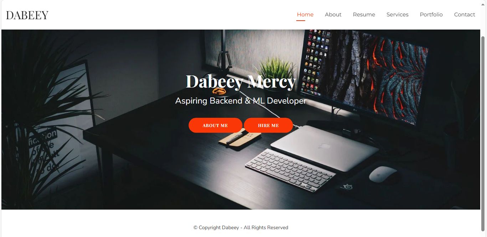

markdown
# Portfolio Website

 <!-- Optional banner image -->

A modern portfolio website built with Python, showcasing my projects, skills, and professional background.

## ✨ Live Demo
[View Live Portfolio](https://yourusername.github.io/portfolio-website/) <!-- Update with your URL -->

## 🛠️ Technologies Used
- **Backend**: 
  
   <!-- or Django -->
  
- **Frontend**:
  
  
  

- **Tools**:
  
  

## 📦 Installation

### Prerequisites
- Python 3.8+
- pip package manager

### Setup Instructions
1. Clone the repository:
   ```bash
   git clone https://github.com/Dabeey/portfolio-website.git
   cd your-repo
Create and activate virtual environment:

bash
python -m venv venv
# On Windows:
venv\Scripts\activate
# On macOS/Linux:
source venv/bin/activate


# Install dependencies:
pip install -r requirements.txt

# Set up environment variables:
Create a .env file based on .env.example
Add your configuration values

# 🚀 Running the Application
bash
# Development mode
python app.py  { or whatever your main file is called }


# 🌟 Features
Responsive Design: Works on all devices

Project Showcase: Filterable project gallery

Contact Form: With email integration

Blog Section (if applicable): Markdown-powered blog

# 🤝 Contributing
Contributions are welcome! Please follow these steps:

Fork the project

Create your feature branch (git checkout -b feature/AmazingFeature)

Commit your changes (git commit -m 'Add some amazing feature')

Push to the branch (git push origin feature/AmazingFeature)

Open a Pull Request

# 📄 License
This project is licensed under the MIT License - see the LICENSE file for details.

# 📬 Contact
Dabeey - @dev_dabeey - abbasdaughter18@gmail.com

Project Link: https://github.com/Dabeey/portfolio-website.git

